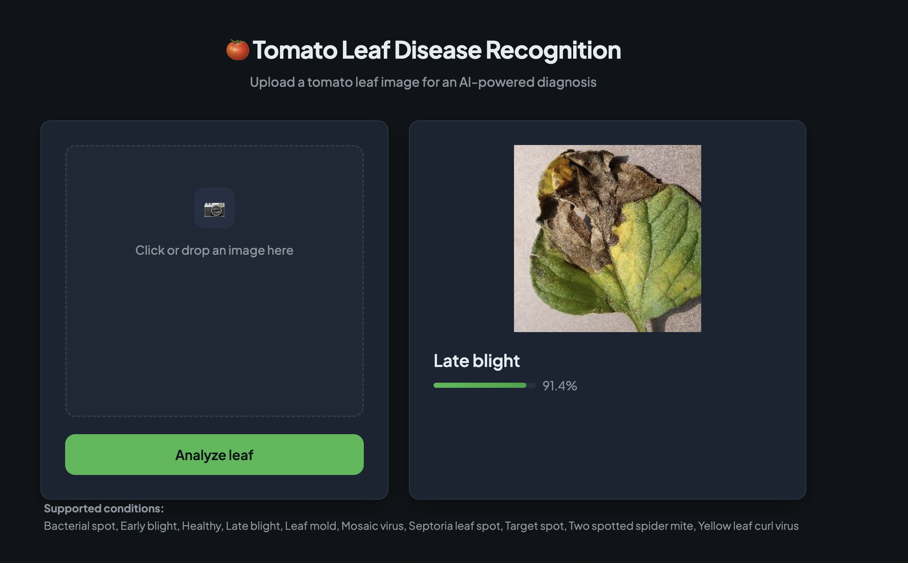

# Tomato Leaf Disease Recognition

AI-powered web app to identify tomato leaf diseases from images. Upload a photo of a tomato leaf and get an instant prediction with confidence score.



## Project structure

```
tomato_recognition_model/
├── Model/
│   └── recognition_model.ipynb   # Training notebook
├── models/
│   ├── recognition_model.keras  # Trained model (generated; preferred)
│   ├── recognition_model.h5     # Legacy format (optional fallback)
│   ├── best_model.keras         # Best checkpoint during training (optional)
│   └── class_names.json         # Class labels (generated)
├── preview/
│   └── img_classification_model.png  # Project preview
├── templates/
│   └── index.html               # Web UI
├── Tomato_Images/               # Training dataset
├── app.py                       # Flask server
├── requirements.txt
└── README.md
```

## Supported conditions

The model can detect 10 conditions:

- Bacterial spot  
- Early blight  
- Late blight  
- Leaf mold  
- Septoria leaf spot  
- Spider mites (Two-spotted spider mite)  
- Target spot  
- Tomato Yellow Leaf Curl Virus  
- Tomato mosaic virus  
- Healthy  

## 1. Train the model (optional)

If you need to retrain or train from scratch:

1. Place your dataset in `Tomato_Images/` with one folder per class (folder name = class name).
2. Open `Model/recognition_model.ipynb` in Jupyter or VS Code.
3. Run all cells. The notebook:
   - Loads images with an 80/20 train–validation split, then splits the 20% into validation and test.
   - Checks class balance and uses data augmentation (flips, rotation, zoom, contrast).
   - Builds a CNN with BatchNorm, Dropout, and L2 regularization.
   - Trains with **EarlyStopping** (patience 8), **ModelCheckpoint** (saves best model), and **ReduceLROnPlateau**.
   - Evaluates on the test set and shows a **confusion matrix** and **classification report** (precision, recall, F1 per class).
   - Saves the best model as `models/recognition_model.keras` and `models/class_names.json`.

If you trained on **Google Colab**, download `recognition_model.keras` (or `recognition_model.h5`) and `class_names.json` into the `models/` folder.

## 2. Run the web app

From the project root:

```bash
pip install -r requirements.txt
python app.py
```

Open **http://127.0.0.1:7860** in your browser. Upload a tomato leaf image and click **Analyze leaf** to get the prediction.

The app loads `models/recognition_model.keras` if present, otherwise falls back to `models/recognition_model.h5`.

## Tech stack

- **Backend:** Flask  
- **UI:** HTML, CSS, JavaScript (`templates/index.html`)  
- **Model:** TensorFlow / Keras (CNN with preprocessing, augmentation, and regularization)  

The app runs locally; only you can access it.

## Requirements

- Python 3.8+
- TensorFlow ≥ 2.10
- Flask
- Pillow
- NumPy
- scikit-learn (for confusion matrix and classification report in the notebook)
- seaborn (for plotting in the notebook)
